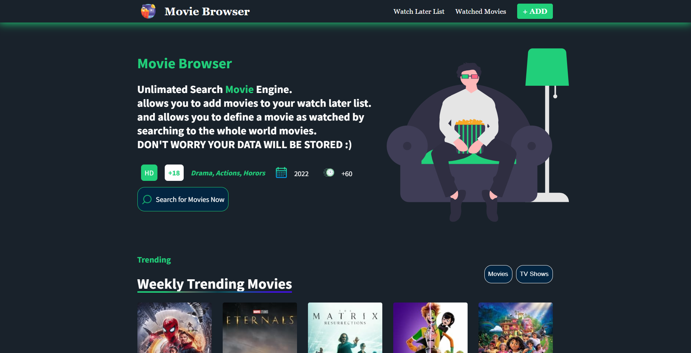
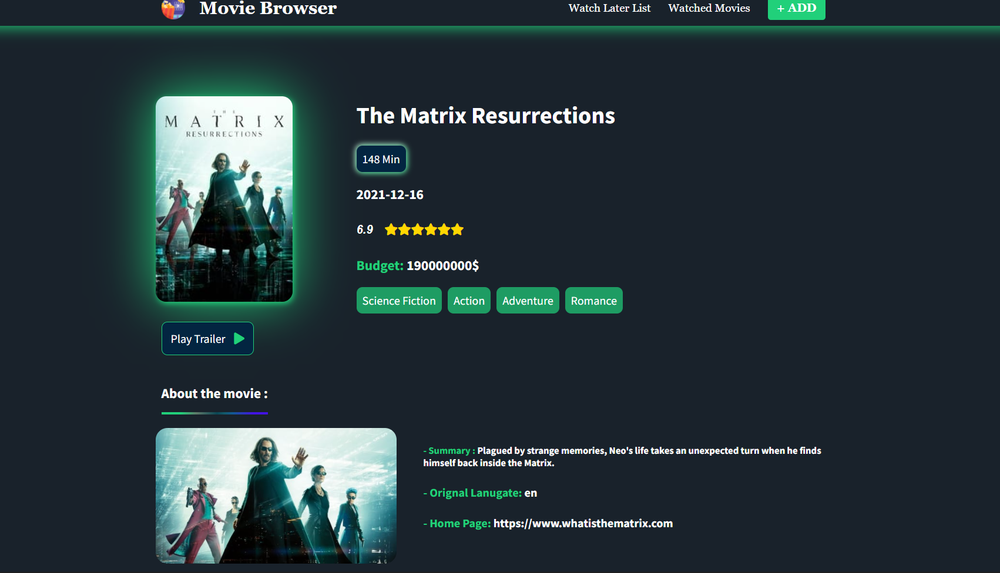
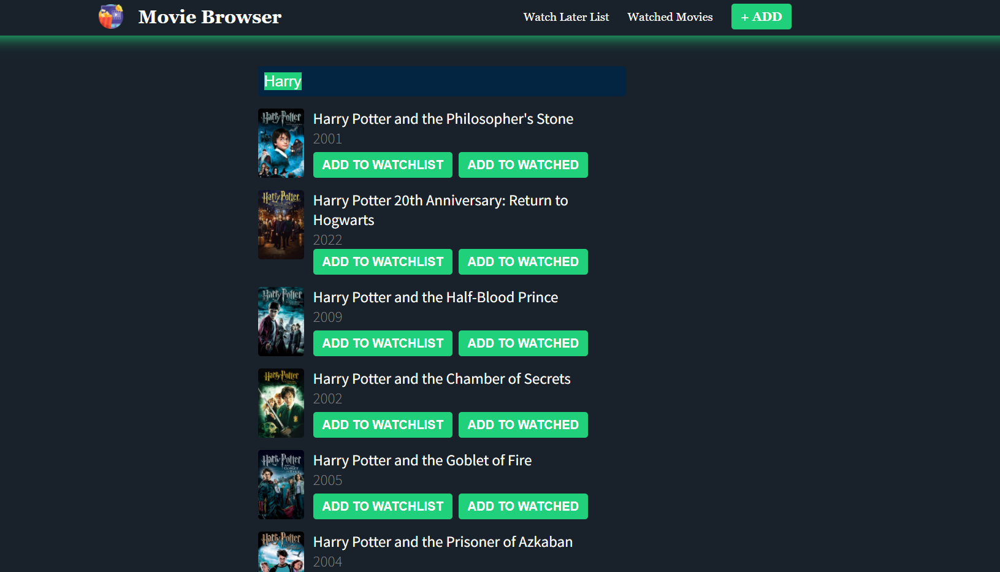
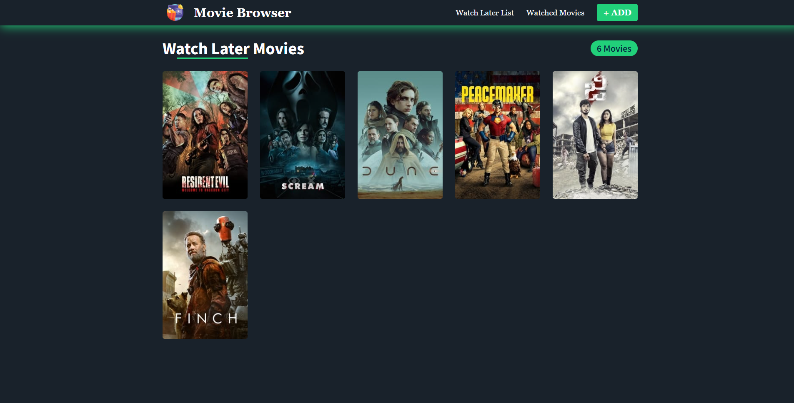
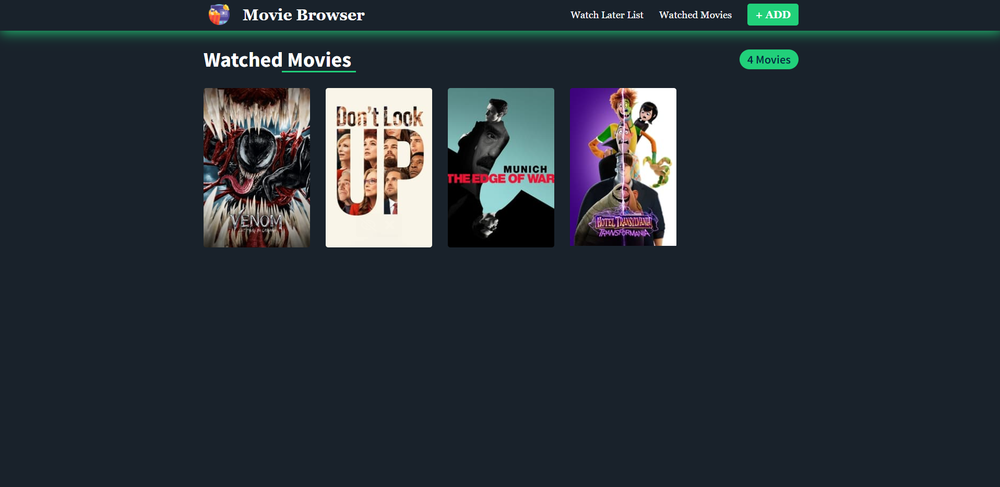

# MoviesBrowser-WebApp

### Description of the App:
A Web application built with (HTML, CSS, JS, React JS), that's allow the user to search for movies and tv shows and see full details about them and add them to his watch list or watched movies(DATA WILL BE STORED USING LOCAL STORAGE)
* **Description of the main functionality:**
  * Fetching an a movie API and get info.
  * store the user prefered movie using API Context (ReactJS) and Hooks and then store it as Local storage in website cache.
  * User has the ability to search for any movie and add them to his watch later list or as a watched movie.
  * User has the ability also to remove his watched movies or watch later movies any time.
  * Showing the weekly trending movies around the world in the landPage (intro page).
  * user is able to see the details about the movie that he want.
  * Website is fully responsive at any screen size (Media Quries Pure Css).

* **Technologies used:**
  * _HTML5_
  * _CSS3_
  * _JS_
  * _ReactJS_
  * _Font Awesome Library_
  * _React Rating Library_
  * _Normal ReactJS API calling and fetching_
* **Main implementation problems you had facing [Personal Opinon]:**
  * Problem with using ReactJS hooks some hooks and classes are Deprecated 
  * useEffect hook when calling two different API it was hard to use it without the clean up function 
  * Looping inside html Element with JSX 
  * Challenge of not using FrameWork to make the website Responsive, instead do it with CSS

* Screenshots of the internal app after building:

</img>
</img>
</img>
</img>
</img>

* for the purpose of the Copyrights (credits) the following Website API is used:
  * API: https://www.themoviedb.org/
